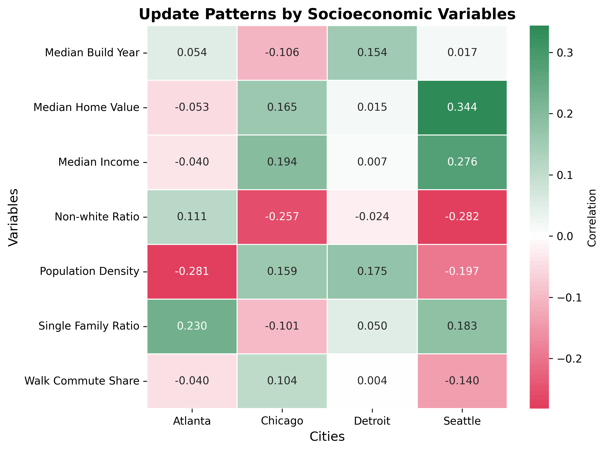

# GSVantage

**GSVantage** is an interactive dashboard designed to visualize and analyze disparities in Google Street View (GSV) image update frequency across urban neighborhoods. Built using modern web technologies, GSVantage integrates Google Street View metadata with U.S. Census American Community Survey (ACS) data, highlighting critical relationships between imagery freshness and demographic indicators.

This project represents the final stage of a comprehensive pipeline:

1. **[GSV Tracker](https://github.com/jonfroehlich/gsv-tracker)**: Collects GSV imagery metadata.
2. **[GSV Coverage Summaries](https://github.com/Zaynwang1/GSV-coverage)**: Aggregates GSV metadata and joins it with ACS demographic data at the census block group level.
3. **GSVantage**: Presents interactive visualizations enabling exploratory analysis of spatial equity.

🔗 **Live Dashboard:** [https://cse512.pages.cs.washington.edu/25sp/fp/gsvantage](https://cse512.pages.cs.washington.edu/25sp/fp/gsvantage)

---

## Why It Matters

* Street View imagery supports critical urban analyses such as infrastructure planning and public health studies.
* Unequal update frequencies across neighborhoods may introduce biases, negatively impacting marginalized communities.
* GSVantage helps uncover these digital inequities through visual exploration and data-driven insights.

---

## Features

* **Interactive Map:** Visualize GSV image staleness across census block groups.
* **Linked Scatter Plots:** Explore relationships between image staleness and demographic variables:

  * Median Income
  * Median Home Value
  * Population Density
  * Nonwhite Ratio
  * Walk-to-Work Share
  * Single-Family Housing Ratio
* **Brushing and Filtering:** Dynamically filter and highlight specific demographic segments.
* **City Selector:** Example data provided for Atlanta, Chicago, Detroit, and Seattle.
* **Hover Tooltips:** Detailed contextual information upon hovering over visual elements.

---

## Getting Started

### Prerequisites

* [Node.js](https://nodejs.org/) (LTS recommended)
* npm (included with Node.js)

### Installation

Clone the repository:

```bash
git clone https://github.com/yourusername/GSVantage.git
cd GSVantage
```

Install dependencies:

```bash
npm install
```

Run the development server:

```bash
npm run dev
```

Access the dashboard at [http://localhost:5173](http://localhost:5173) (default port).

Build for production:

```bash
npm run build
```

The compiled assets are located in the `dist/` directory, suitable for deployment to static hosting services.

---

## Extensibility

To incorporate additional cities:

1. Generate new GeoJSON data using [GSV Coverage](https://github.com/Zaynwang1/GSV-coverage).
2. Add GeoJSON files to the `data/` directory.
3. Update city metadata and configuration within the application.

This pipeline supports generalized analysis across any U.S. city with appropriate data.

---

## Sample Insights

*Insights from the provided example cities:*

- Higher-density and more diverse neighborhoods often have more recent GSV images.
- Wealthier, suburban areas typically show older imagery.
- A higher walk-to-work ratio consistently predicts fresher imagery.
- Correlation strength varies significantly across different cities, highlighting localized contexts.

> These findings are illustrative examples from selected cities and may not generalize broadly.

### Visual Examples:

**Update Patterns by City and Socioeconomic Variables**




---

## Technologies Used

* [Observable Framework](https://observablehq.com/framework/): Reactive, component-based JavaScript for visualization
* [D3.js](https://d3js.org/): Data-driven interactive visualizations
* [Leaflet.js](https://leafletjs.com/): Interactive web maps
* [Observable Plot](https://observablehq.com/plot): Concise statistical plotting

---

## Acknowledgments

* Developed by Zeyu Wang and Yingchao Jian
* Guidance and support from Dr. Don Mackenzie, Dr. Jeffrey Heer, and Dr. Jon E. Froehlich
* Built upon foundational tools:

  * [GSV Tracker](https://github.com/jonfroehlich/gsv-tracker)
  * [GSV Coverage Summaries](https://github.com/Zaynwang1/GSV-coverage)

---

## License

Distributed under the MIT License. See `LICENSE` for more information.
