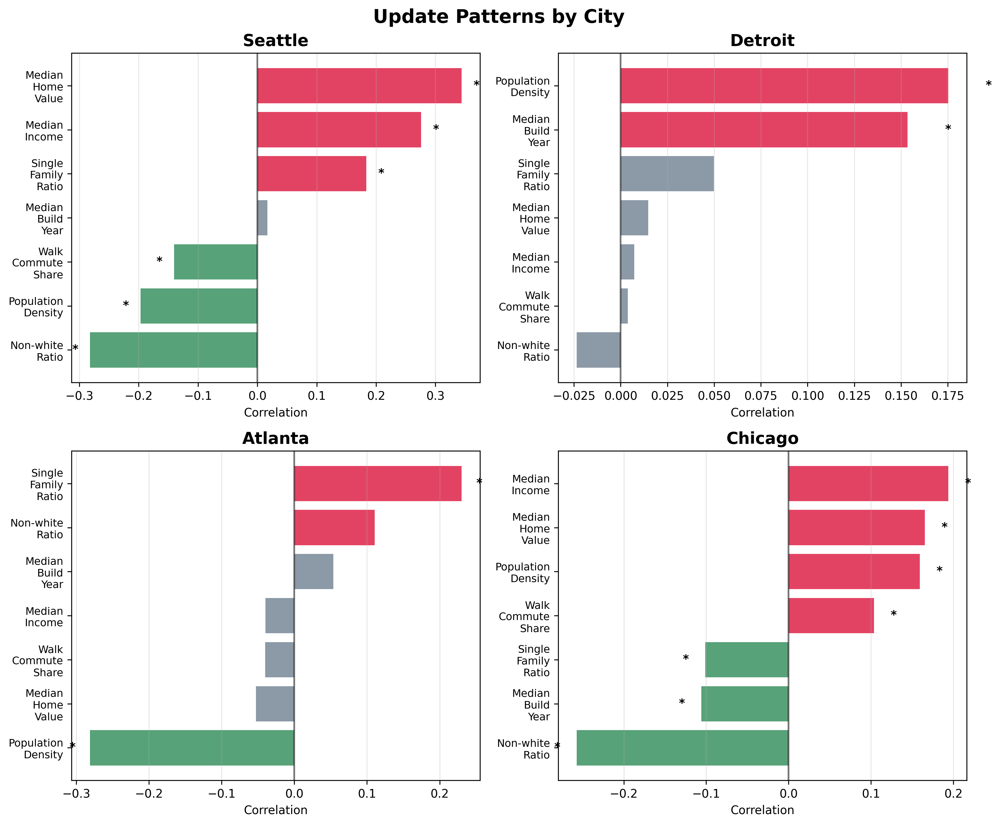
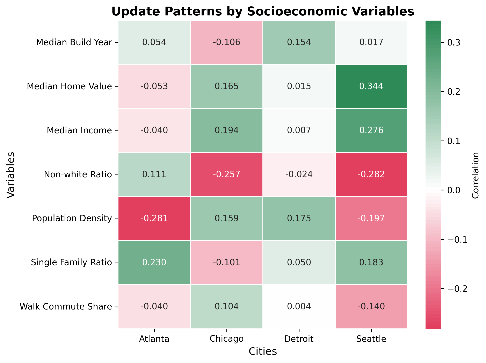

  <h1>GSVantage</h1>
  <h2>Accessing the Visibility Gap in Google Street View’s Urban Digital Landscape</h2>
  <h3>Group members: Zeyu Wang, Yingchao Jian</h3>
  <h5>We acknowlegde the advice given by Dr. Don Mackenzie, Dr. Jeffrey Heer, Dr. Jon E. Froehlich</h5>

  

---

## Why It Matters

- Street-level imagery plays a vital role in urban informatics, supporting infrastructure planning, public health research, and real estate analysis
- However, disparities in how often these images are updated can lead to digital inequity across neighborhoods
- Uneven coverage may bias data-driven decisions in cities, especially for underrepresented or marginalized communities
- Identifying and addressing such disparities is critical for equitable urban analytics and responsible use of geospatial technologies

  

---

## Intended Audience

- Urban data researchers
- Policymakers and planners
- Visualization and GIS developers

---

## Dashboard Overview

- Built with D3.js, Observable Plot, and Leaflet
- Supports exploration of GSV image staleness across U.S. cities
- Integrates ACS demographic data and GSV metadata at the Census block group level, and user can choose neighbourhood of their interest using the fliters.

  

---

## Key Features

- Map showing average image staleness
- Interactive scatter plots for comparing staleness with:
  - Median Income
  - Median Home Value
  - Population Density
  - Nonwhite Ratio
  - Walk Share
  - Single Family Home Raito
- Brushing and filtering across all linked views
- City dropdown: Atlanta, Chicago, Detroit, Seattle
- Sliders and selectors for filtering demographic ranges
- Cross-city heatmap of correlation coefficients (Pending)

---

## Interactivity

- Hover on maps and scatter plots for detailed info
- Select and compare neighborhoods dynamically
- Reset filters with one click

---

## Extensibility

- Add new cities by supplying additional GeoJSON + ACS data
- Modular code structure supports plug-and-play additions

---

## Key Results - Crosscity Comparison

- Denser and higher-minority neighborhoods tend to have more up-to-date Street View imagery  
- Affluent, single-family, and lower-density areas are often covered by older imagery  
- Walk-to-work share is the most consistently negative predictor of image staleness across all cities  
- Correlation strength varies by city; Detroit shows weaker and less consistent patterns  

These results are only vailded based on the currect observation; We have aware that the selected cities can not fully represent the full picture; It's just a show case that there can be differences and consistency between cities. 

  
  

